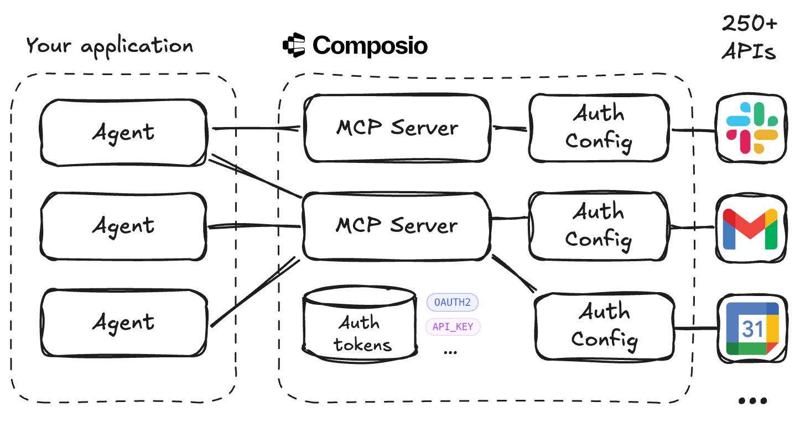

# Agent Authorization Without the Pain

Your agent needs to read from your Google Calendar and send emails through Gmail. Simple, right? Until you realize you need OAuth flows, token refresh logic, and secure credential storage. Multiply that by every API your agent needs.

Connect your agents to 250+ APIs and 3000+ tools with MCP and Composio. Composio manages authorization, remote MCP servers and tool execution, your application focuses on agentic reasoning and tool usage. 

Disclaimer: I'm not affiliated with Composio, I'm just a happy user. What they do is IMO the right separation of concerns when building agentic applications.

## Architecture



**Your Application**
- Agents connect to Composio MCP servers and use their tools
- Agents acts on behalf of users that authorized access to their accounts
- Agents focus on reasoning and tool usage, not plumbing

**Composio Layer**
- MCP servers act as protocol bridges to external APIs
- Each API has auth configs, with an connected account per user
- Auth tokens are stored securely, supporting OAuth2, API keys, etc.

**Key Benefits**
- No OAuth flows or token management in your code
- Access 250+ APIs and 3000+ tools through model context protocol (MCP)
- Clean separation between agent logic and API integration

## Example

https://github.com/user-attachments/assets/652a0cc1-0579-418d-a3fb-b15aaaddfe31

The complete code for running this example is [in this repository](https://github.com/krasserm/agent-auth).

- [`setup_mcp_server.py`](setup_mcp_server.py) creates MCP servers for Gmail and Google Calendar with the [Composio Python library](https://github.com/ComposioHQ/composio-base-py)
- [`use_mcp_server_pydantic_ai.py`](use_mcp_server_pydantic_ai.py) runs `o4-mini` as Pydantic AI agent configured with the Gmail and Google Calendar MCP servers
- [`use_mcp_server_gemini.py`](use_mcp_server_gemini.py) runs `gemini-2.5-flash` with the `google-genai` SDK configured with the Google Calendar MCP server.

Here's a brief overview of the key steps, using Google Calendar as an example:

1. Install the [Composio Python library](https://github.com/ComposioHQ/composio-base-py).

   ```bash
   pip install composio-client
   ```

2. Create an auth configuration for the `googlecalendar` API, with `OAUTH2` as `authScheme`.

   ```python
   client = Composio(api_key=os.getenv("COMPOSIO_API_KEY"))

   response = client.auth_configs.create(
       toolkit={"slug": "googlecalendar"},
       auth_config={
           "name": "calendar-example", 
           "type": "use_composio_managed_auth",
           "authScheme": "OAUTH2"
       }
   )
   auth_config_id = response.auth_config.id
   ```

3. Create a connected account and link an application-defined `user_id` to it (`martin` in this example).

   ```python
   response = client.connected_accounts.create(
       auth_config={"id": auth_config_id},
       connection={"user_id": "martin"},
   )
   ```

4. Initiate the authorization process by redirecting to an OAuth consent screen in a browser window. 

   ```python
   import webbrowser

   webbrowser.open(response.connection_data.val.redirect_url)
   ```

5. Create an MCP server for the auth config created in step 2 and specify the tools that should be exposed.

   ```python
   result = client.mcp.create(
       name="calendar-mcp-server",
       auth_config_ids=[auth_config_id],
       allowed_tools=["GOOGLECALENDAR_FIND_EVENT"]
   )
   ```

6. Create an MCP server URL that uses the connected account linked to `martin`.

   ```python
   mcp_url = result.mcp_url.replace("transport=sse", "user_id=martin")
   # i.e. https://mcp.composio.dev/composio/server/<uuid>?user_id=martin
   # <uuid> is a string of pattern 12345678-90ab-cdef-1234-567890abcdef
   ```

7. Configure an agent with the MCP server URL to access tools authorized in step 4.

   ```python
   from pydantic_ai import Agent
   from pydantic_ai.mcp import MCPServerStreamableHTTP

   agent = Agent(
       'openai:o4-mini',
       toolsets=[
           MCPServerStreamableHTTP(mcp_url),  
       ]
   )

    async with agent:
        result = await agent.run(
            "List my Sep 2025 calendar events and save them as draft to my gmail account "
            "(subject: Sep 2025 events, recipient: martin@example.com)."
        )
    
    print(result.output)
   ```
